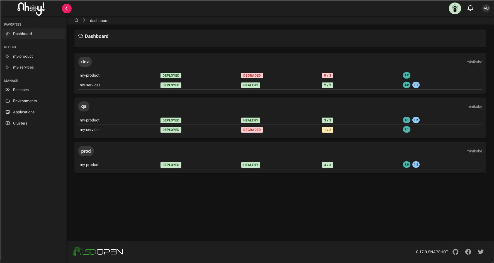
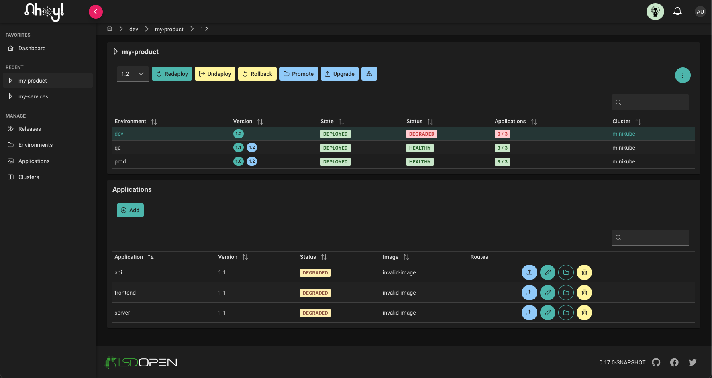

<picture>
  <source media="(prefers-color-scheme: dark)" srcset="./docs/images/logo-light.png">
  <source media="(prefers-color-scheme: light)" srcset="./docs/images/logo-dark.png">
  
</picture>

# Ahoy - Release management for Kubernetes

## What is Ahoy?

Ahoy helps teams release and manage applications and services across multiple k8s clusters without needing to write any yaml.

Think Helm, Git, GitOps, Continuous Deployment using ArgoCD awesomeness, all done for you..

### Release managers can:

- define multiple k8s clusters, environments and versioned releases
- deploy, promote and upgrade applications and services across environments
- get an overview of the status of releases across environments and clusters

### Dashboard

<picture>
  <source media="(prefers-color-scheme: dark)" srcset="./docs/images/dashboard-dark.png">
  <source media="(prefers-color-scheme: light)" srcset="./docs/images/dashboard-light.png">
  
</picture>

### Manage Release

<picture>
  <source media="(prefers-color-scheme: dark)" srcset="./docs/images/manage-release-dark.png">
  <source media="(prefers-color-scheme: light)" srcset="./docs/images/manage-release-light.png">
  
</picture>

## Documentation

- [Installation](./docs/install.md)
- [Setup](./docs/setup.md)
- [Additional cluster setup](./docs/add-cluster.md)
- [Users and Roles](./docs/users_roles.md)
- [Notes](./docs/notes.md)
